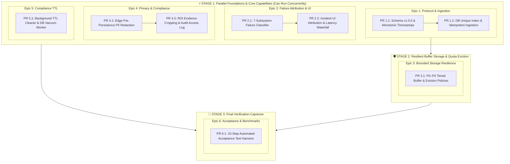

# FORGE — MVP Implementation Roadmap & Stage Breakdown

> **Reference Specification:** [`docs/MVP_SPEC.md`](docs/MVP_SPEC.md)  
> **Guiding Principle:** Every phase transitions Forge closer to a production-grade industrial failure-explanation system compliant with industrial reliability and European privacy-by-design standards.

---

## 1. Executive Summary: The 3-Stage Delivery Model

To maximize development velocity while maintaining strict architectural decoupling, the remaining work from [`docs/MVP_SPEC.md`](docs/MVP_SPEC.md) is structured into **3 Sequential Stages** comprising **6 Epics** and **9 discrete Pull Requests (PRs)**:

*   **⚡ Stage 1 (Parallel Foundations & Core Capabilities):** **Epics 1, 2, 4, and 5**  
    *Can be developed completely in parallel.* These four epics touch orthogonal components with zero file conflicts: the edge-to-backend wire protocol (Epic 1), the incident root-cause classifier & UI (Epic 2), the edge worker PII redaction filter (Epic 4), and the database TTL cleanup worker (Epic 5).
*   **🛡️ Stage 2 (Resilient Storage & Quota Eviction):** **Epic 3**  
    *Integrates Stage 1 wire contracts into local buffer resilience.* Builds tiered P0–P4 priority storage quotas, high-watermark (80%) disk shedding, and the 95% safety circuit breaker into `EdgeBuffer`.
*   **🏁 Stage 3 (Verification Capstone & Acceptance Testing):** **Epic 6**  
    *Validates the entire integrated system.* Executes the end-to-end 10-step multi-service failure injection test harness and enforces all quantitative reliability criteria.

---

## 2. Master Stage & PR Tracking Matrix

| Stage | Epic | PR | Title | Core Target Files | Est. Scope | Status |
| :---: | :---: | :---: | :--- | :--- | :---: | :---: |
| **Stage 1** | **Epic 1** | **PR 1.1** | Schema v1.0.0 & Nanosecond Lifecycle Timestamps | `app/api/routes.py`, `app/edge/service.py` | ~250 LOC | [ ] Pending |
| **Stage 1** | **Epic 1** | **PR 1.2** | Backend Unique Index & Idempotent Ingestion Engine | `app/storage/database.py`, `app/api/routes.py`, `main.py` | ~200 LOC | [ ] Pending |
| **Stage 1** | **Epic 2** | **PR 2.1** | 7-Subsystem Root-Cause Failure Attribution Engine | `app/incidents/incident_engine.py`, `app/incidents/trigger_rules.py` | ~300 LOC | [ ] Pending |
| **Stage 1** | **Epic 2** | **PR 2.2** | Incident Dossier UI Presentation & Attribution Badge | `dashboard/src/components/IncidentModal.jsx`, `IncidentFeed.jsx` | ~220 LOC | [ ] Pending |
| **Stage 1** | **Epic 4** | **PR 4.1** | Edge-Side Pre-Persistence Worker PII Redaction | `app/edge/service.py`, `app/edge/privacy.py` | ~280 LOC | [ ] Pending |
| **Stage 1** | **Epic 4** | **PR 4.2** | ROI-Only Evidence Cropping & Tamper-Evident Audit Log | `app/incidents/evidence_manager.py`, `app/storage/database.py` | ~220 LOC | [ ] Pending |
| **Stage 1** | **Epic 5** | **PR 5.1** | Automated TTL Retention & Cryptographic DB Vacuuming | `app/storage/maintenance.py`, `main.py` | ~200 LOC | [ ] Pending |
| **Stage 2** | **Epic 3** | **PR 3.1** | P0–P4 Tiered Queue & High-Watermark Eviction Policies | `app/edge/buffer.py`, `app/edge/service.py` | ~350 LOC | [ ] Pending |
| **Stage 3** | **Epic 6** | **PR 6.1** | 10-Step Automated Acceptance Test Harness & Benchmarks | `tests/test_mvp_acceptance_protocol.py` | ~450 LOC | [ ] Pending |

---

## 3. Stage 1: Parallel Foundations & Core Capabilities

> **Characteristics:** All four epics below have **zero shared file conflicts** and can be implemented in independent parallel branches.

### Epic 1: Telemetry Schema Contract & Idempotent Deduplication
*Goal: Establish stable distributed identities and nanosecond monotonic duration tracking to eliminate duplicate metrics during re-syncs.*

#### PR 1.1: Schema v1.0.0 & Nanosecond Lifecycle Timestamps
* **Objective:** Upgrade edge payloads and backend ingestion endpoints to Schema v1.0.0 with monotonic lifecycle time tracking.
* **Target Files:**
  * `app/api/routes.py` (`EdgeSyncBatch`, `FramePayloadSchema`)
  * `app/edge/service.py` (Payload generation, `boot_id`, `sequence_number`)
  * `app/edge/buffer.py` (Payload metadata preservation)
* **Key Deliverables:**
  * Generate UUID `boot_id` once per edge process launch; increment strictly monotonic `sequence_number` per captured frame.
  * Populate full nanosecond lifecycle array:
    * `captured_at_ns` (monotonic sensor grab time)
    * `inference_started_at_ns` & `inference_completed_at_ns`
    * `queued_at_ns` & `transmitted_at_ns`
    * `received_at_ns` & `persisted_at_ns` (backend side)
* **Acceptance Criteria:**
  * Payload validation against `schema_version: "1.0.0"` in `/api/edge/sync`.
  * Monotonic clock consistency test: zero negative lifecycle durations across transitions.

#### PR 1.2: Backend Unique Index & Idempotent Ingestion Engine
* **Objective:** Ensure duplicate batches caused by dropped HTTP ACKs or network retries do not create duplicate database rows or skewed metrics.
* **Target Files:**
  * `app/storage/database.py` (Table constraints, query helpers)
  * `app/api/routes.py` (Ingestion deduplication accounting)
  * `main.py` (`process_edge_sync_batch`)
* **Key Deliverables:**
  * Add compound unique constraint: `UNIQUE(source_id, boot_id, sequence_number)` on `frame_metrics`.
  * Implement idempotent insert pattern (`ON CONFLICT DO NOTHING`).
  * Return `frames_ingested` and `frames_deduplicated` in `/api/edge/sync` HTTP 200 response.
* **Acceptance Criteria:**
  * Re-transmitting an identical 50-frame batch three times yields exactly 50 records in the database and 0 duplicate rows.

---

### Epic 2: Multi-Subsystem Failure Attribution Engine
*Goal: Categorize defects and anomalies into 7 distinct industrial root-cause failure modes.*

#### PR 2.1: 7-Subsystem Root-Cause Failure Classifier
* **Objective:** Implement rule heuristics in the Incident Engine to determine whether an anomaly stems from optical, hardware, environmental, model, or network faults.
* **Target Files:**
  * `app/incidents/incident_engine.py`
  * `app/incidents/trigger_rules.py`
  * `app/storage/database.py` (Add `subsystem_attribution` and `root_cause_reason` fields to `Incident`)
* **Key Deliverables:**
  * Formal heuristic evaluators:
    1. `FAILURE_SUBSYSTEM_CAMERA`: `fps == 0` for $>3.0\text{s}$ while pipeline is running.
    2. `FAILURE_OPTICAL_DEFOCUS`: High anomaly score correlated with Laplacian variance $< T_{blur}$.
    3. `FAILURE_OPTICAL_SENSOR_NOISE`: High anomaly score correlated with high-frequency noise variance $> T_{noise}$.
    4. `FAILURE_ENVIRONMENTAL_LIGHTING`: Frame luminance mean $< T_{dark}$.
    5. `FAILURE_MODEL_INFERENCE_STALL`: Inference latency $> 3\times$ baseline with nominal hardware metrics.
    6. `FAILURE_HARDWARE_GPU_EXHAUSTION`: Sustained 100% GPU / high VRAM / thermal throttle flag.
    7. `FAILURE_NETWORK_PARTITION`: Monotonic buffer growth while `ack_age > 10.0\text{s}`.
* **Acceptance Criteria:**
  * Synthetic chaos injection tests correctly assign attribution in $\ge 95\%$ of test cases.

#### PR 2.2: Incident Dossier UI Presentation & Attribution Badge
* **Objective:** Provide factory operators with an instant visual breakdown of the failure subsystem and latency waterfall.
* **Target Files:**
  * `dashboard/src/components/IncidentModal.jsx`
  * `dashboard/src/components/IncidentFeed.jsx`
  * `dashboard/src/App.css`
* **Key Deliverables:**
  * Distinct color-coded badge chips for each failure category (e.g., Optical Defocus = Amber, Hardware = Red, Environmental = Blue).
  * Lifecycle Latency Waterfall bar showing time spent in capture $\to$ inference $\to$ buffer $\to$ sync $\to$ persistence.
* **Acceptance Criteria:**
  * Operator can click any incident to view the exact attributed failure cause and stage duration breakdown.

---

### Epic 4: European Privacy-by-Design & Industrial Compliance
*Goal: Satisfy GDPR Art. 5/25 and German Works Council (Betriebsrat) co-determination rules.*

#### PR 4.1: Edge-Side Pre-Persistence Worker PII Redaction
* **Objective:** Mask worker hands, arms, and faces in memory immediately upon capture before any data touches disk or inference models.
* **Target Files:**
  * `app/edge/privacy.py` (New module: fast in-memory skin-region and facial blurring filter)
  * `app/edge/service.py` (Pre-inference redaction pipeline)
* **Key Deliverables:**
  * Fast in-memory skin and facial region detection with Gaussian blurring or black-box masking.
  * Ensure raw biometric data is never serialized into `outputs/edge_buffer.db` or sent in preview streams.
* **Acceptance Criteria:**
  * PII redaction executes with $\le 15\text{ ms}$ latency overhead, maintaining $\ge 10\text{ FPS}$ throughput.
  * Forensic inspection confirms zero unmasked worker biometric data in SQLite or disk snapshots.

#### PR 4.2: ROI-Only Evidence Cropping & Tamper-Evident Audit Log
* **Objective:** Implement data minimization by cropping incident frames to defect ROIs, and log all operator evidence access.
* **Target Files:**
  * `app/incidents/evidence_manager.py` (ROI cropping around defect bounding boxes)
  * `app/storage/database.py` (`AuditLog` table for evidence views and downloads)
  * `app/api/routes.py` (Audit logging endpoints `/api/incidents/{id}/evidence`)
* **Key Deliverables:**
  * Store cropped defect bounding boxes and heatmap overlays; discard peripheral conveyor background.
  * Record immutable audit log entries (timestamp, client IP, user agent, incident ID) on every evidence view/export.
* **Acceptance Criteria:**
  * Evidence snapshots contain strictly inspection ROIs.
  * Every evidence retrieval creates a queryable audit record in SQLite.

---

### Epic 5: Automated TTL Retention & Cryptographic Data Scrubbing
*Goal: Enforce automated data lifecycle expiration and secure filesystem reclamation.*

#### PR 5.1: Background TTL Cleaner & DB Vacuum Worker
* **Objective:** Purge expired telemetry and incident records automatically without leaving orphaned files.
* **Target Files:**
  * `app/storage/maintenance.py` (New background maintenance worker)
  * `main.py` (Register lifespan task)
  * `app/storage/database.py` (Purge queries)
* **Key Deliverables:**
  * 72-hour TTL: Purge routine frame metrics and diagnostic telemetry older than 3 days.
  * 30-day TTL: Purge resolved P0 incident dossiers and evidence images older than 30 days.
  * Secure unlinking of image files on disk followed by periodic SQLite `VACUUM`.
* **Acceptance Criteria:**
  * Automated test verifies synthetic 73-hour-old metrics and 31-day-old incidents are deleted and disk space is reclaimed.

---

## 4. Stage 2: Resilient Buffer Storage & Quota Eviction

> **Characteristics:** Depends on the Schema v1.0.0 payload structures established in Stage 1 (PR 1.1).

### Epic 3: Bounded Storage & Prioritized Evidence Eviction
*Goal: Protect edge storage from unconstrained growth while strictly preserving P0 incident evidence.*

#### PR 3.1: P0–P4 Tiered Queue & High-Watermark Eviction Policies
* **Objective:** Introduce priority-based storage quotas and high-watermark eviction in `EdgeBuffer`.
* **Target Files:**
  * `app/edge/buffer.py`
  * `app/edge/service.py`
* **Key Deliverables:**
  * Implement priority classification:
    * **P0 (Incident Evidence):** Locked, never evicted automatically.
    * **P1 (Anomalies):** Retained until buffer hits 80% watermark; evicted FIFO.
    * **P2 (Thumbnails/Keyframes):** Rotating window of latest $N=100$.
    * **P3 (Telemetry):** Downsampled into 10-second averages when disk constrained.
    * **P4 (Nominal Video):** RAM ring buffer only; discarded after inference.
  * Safety circuit breaker: At 95% disk usage, halt local video caching and fire high-priority storage alarm.
* **Acceptance Criteria:**
  * Under sustained 1,000-frame offline accumulation, zero P0 incidents are dropped, and memory remains $\le 500\text{ MB}$ RSS.

---

## 5. Stage 3: Final Verification Capstone & Acceptance Testing

> **Characteristics:** Capstone verification harness validating all Stage 1 & Stage 2 capabilities functioning end-to-end.

### Epic 6: 10-Step Acceptance Test Protocol & CI/CD Verification Harness
*Goal: Automate end-to-end failure injection and verify all quantitative criteria from Section 6 of MVP_SPEC.md.*

#### PR 6.1: 10-Step Automated Acceptance Test Harness
* **Objective:** End-to-end multi-service test suite executing the 10-step sequence without manual intervention.
* **Target Files:**
  * `tests/test_mvp_acceptance_protocol.py` (New test suite)
* **Key Deliverables:**
  * Automated test runner executing:
    1. Step 1: Nominal baseline ($<0.50$ score, 12–15 FPS).
    2. Step 2: Physical sensor degradation injection (blur + noise).
    3. Step 3: Anomaly & incident trigger with attribution.
    4. Step 4: Network link termination.
    5. Step 5: Offline SQLite edge buffering accumulation.
    6. Step 6: Edge process SIGKILL and restart restoration.
    7. Step 7: Network restoration.
    8. Step 8: Idempotent resynchronization & backlog drain.
    9. Step 9: Forensic evidence dossier verification (pre, trigger, post frames).
    10. Step 10: Frontend API forensics verification.
  * Assertions for all quantitative thresholds:
    * $0.0\%$ P0 incident data loss
    * $100\%$ deduplication rate on replay
    * $\le 500\text{ MB}$ RSS edge memory footprint
    * $\ge 100\text{ frames/sec}$ buffer drain throughput
    * $\ge 95\%$ root-cause attribution accuracy
* **Acceptance Criteria:**
  * Full test suite runs via `.venv\Scripts\python.exe -m unittest tests/test_mvp_acceptance_protocol.py` and exits code 0.

---

## 6. Branching & Commit Conventions

* **Branch format:** `feat/stage-<number>-epic-<number>-<slug>` (e.g., `feat/stage-1-epic-1-schema`, `feat/stage-2-epic-3-tiered-buffer`)
* **Commit format:** Conventional Commits (`feat(...)`, `fix(...)`, `test(...)`, `docs(...)`)
* **PR Policy:** Every PR must include:
  1. Dedicated unit and/or integration tests for the new functionality.
  2. Updates to the corresponding checkbox in `ROADMAP.md` and `docs/MVP_SPEC.md`.
  3. Clean execution of `unittest` suite before merge.
