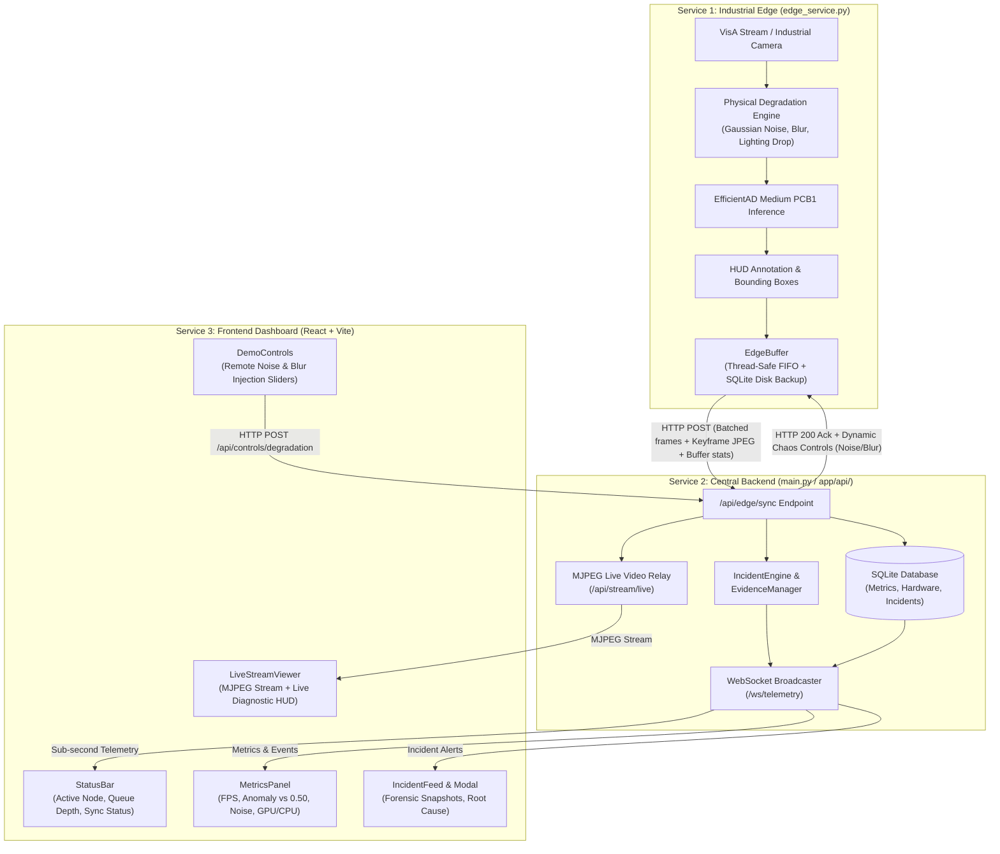

# FORGE — Architecture & System Summary

**Forge** is an Edge-to-Cloud Computer Vision Observability & Incident Detection Platform designed specifically for real-world industrial computer vision deployments (automated optical inspection, conveyor belts, assembly lines).

---

## 1. Core Intentions & Problem Statement

In industrial manufacturing, deploying computer vision models presents distinct challenges:

- **Models Run at the Edge:** Real inference occurs beside physical cameras and conveyor lines on edge devices (Jetson, IPCs), not in a centralized cloud.
- **Network Flakiness:** Factory floor connections can degrade, lag, or drop completely. An observability system must not lose frames or metrics during outages.
- **Physical Sensor Degradation:** Real models fail not just from algorithmic drift, but from physical anomalies: camera vibration, defocus blur, lens dirt, lighting dropouts, and sensor thermal noise.
- **Real-Time Automated Observability:** Operators need instant alerting when defect rates spike or when optical sensors degrade, paired with full forensic evidence.

To ground this in reality, Forge uses:

- **Dataset:** [VisA (Visual Anomaly Dataset)](https://github.com/amazon-science/spot-diff) — specifically `pcb1` (printed circuit boards) containing actual physical defect classes (scratches, bridging, missing components).
- **Model:** [EfficientAD (`thangkt/visionqc-efficientad-medium-pcb1`)](https://huggingface.co/thangkt/visionqc-efficientad-medium-pcb1) — a state-of-the-art anomaly detection model utilizing teacher-student feature distillation and autoencoders.

---

## 2. Distributed 3-Service Architecture

```text
                                 [ INDUSTRIAL EDGE ]
  ┌─────────────────────────────────────────────────────────────────────────────┐
  │                               SERVICE 1: EDGE                               │
  │                                                                             │
  │  [VisA Stream / Camera]                                                     │
  │           │                                                                 │
  │  (Physical Degradation: Gaussian Sensor Noise, Defocus Blur, Lighting Drop) │
  │           │                                                                 │
  │  [Inference: EfficientAD Medium PCB1] ──> Anomaly Score & Defect Heatmap    │
  │           │                                                                 │
  │  [HUD Annotation: Bounding Boxes + Diagnostics Overlay]                     │
  │           │                                                                 │
  │  [EdgeBuffer: Resilient FIFO Queue + SQLite Disk Backup]                    │
  │           │                                                                 │
  │           └───────────┬─────────────────────────────────────────────────────┘
                          │ HTTP POST /api/edge/sync
                          │ (Batched frames + Keyframe JPEG + Buffer stats)
                          │ ◄── HTTP 200 Ack + Dynamic Controls (Noise/Blur)
                          ▼
                 [ CENTRAL SERVER ]
  ┌─────────────────────────────────────────────────────────────────────────────┐
  │                             SERVICE 2: BACKEND                              │
  │                                                                             │
  │  - Edge Sync Processor: Ingests & acknowledges batches                      │
  │  - Live Video Relay: Unpacks base64 JPEGs into MJPEG stream                 │
  │  - SQLite Storage: frame_metrics, system_metrics (NVML GPU), incidents      │
  │  - IncidentEngine: Confidence collapse, defect bursts, latency spikes       │
  │  - EvidenceManager: Saves pre/post incident frame sequences to disk         │
  │  - Telemetry Broadcaster: Sub-second WebSocket stream to connected clients  │
  │  - Static & SPA Server: Serves compiled React dashboard bundle              │
  └───────────────────────┬─────────────────────────────────────────────────────┘
                          │ HTTP /api/stream/live & WebSocket /ws/telemetry
                          ▼
               [ OPERATOR / BROWSER ]
  ┌─────────────────────────────────────────────────────────────────────────────┐
  │                            SERVICE 3: FRONTEND                              │
  │                                                                             │
  │  - StatusBar: [PIPELINE ACTIVE] [EDGE: edge-node-01] [BUF: 4] [SYNCED]      │
  │  - LiveStreamViewer: Real-time annotated edge inspection feed + HUD         │
  │  - MetricsPanel: FPS Throughput, Anomaly Confidence vs. Threshold (0.50),   │
  │    Sensor Noise trend, System Resources (CPU/RAM/GPU), Edge Buffer Health   │
  │  - IncidentFeed & Modal: Live alerts, severity chips, evidence viewer       │
  │  - Chaos Engineering: Live sliders to remotely inject noise/blur to edge    │
  └─────────────────────────────────────────────────────────────────────────────┘
```

### Flow Diagram



---

## 3. Deep Dive: The 3 Services

### Service 1: Forge Edge Node ([`edge_service.py`](../edge_service.py) & [`app/edge/`](../app/edge/))

Runs beside the inspection camera and handles:

- **Sensor Ingestion & Chaos Simulation:** Ingests conveyor frames. Supports pre-inference physical degradations (Gaussian sensor noise, defocus blur, lighting drops, camera latency).
- **EfficientAD Inference:** Computes anomaly heatmaps, confidence thresholds ($0.50$), and defect bounding boxes.
- **Resilient [`EdgeBuffer`](../app/edge/buffer.py):**
  - Thread-safe FIFO queue with capacity limits and drop tracking.
  - **Peek/Ack leasing pattern:** frames stay in the buffer until the backend sends HTTP 200.
  - **SQLite persistence (`outputs/edge_buffer.db`):** buffers survive edge service restarts or power outages.
- **Bi-Directional Sync Worker:** Batches frames and POSTs to `/api/edge/sync`. Reads backend response controls to update local physical degradation parameters on the fly.
- **Offline Resilience:** If the backend is unreachable, the edge buffer retains all frames without crashing and drains automatically upon reconnection.

### Service 2: Forge Backend ([`main.py`](../main.py) & [`app/api/`](../app/api/))

Central hub connecting edge deployments to user interfaces:

- **Edge Ingestion Pipeline:** Validates incoming sync batches, registers edge node heartbeats, updates `EDGE_STATE`, and returns active chaos settings.
- **Incident Engine ([`app/incidents/incident_engine.py`](../app/incidents/incident_engine.py)):** Rule engine checking consecutive anomalies, low confidence, sensor degradation, and latency drops. Triggers structured incidents with pre/post incident evidence frames saved to disk.
- **Hardware Telemetry:** Direct NVML integration to monitor GPU utilization, VRAM usage, and GPU temperature alongside CPU/memory.
- **Live Video Relay:** Exposes `/api/stream/live` (MJPEG) and `/api/stream/frame` (JPEG snapshot) decoded from edge keyframe payloads.
- **WebSocket Telemetry:** Broadcasts synchronized frame metrics and incidents over `/ws/telemetry`.
- **Static & SPA Server:** Serves compiled React dashboard bundle and handles SPA deep-link routing.

### Service 3: Frontend Dashboard ([`dashboard/`](../dashboard/))

High-density React + Vite + Recharts observability UI:

- **StatusBar:** Displays pipeline health, source details, active edge node badge (`EDGE: edge-node-01`), edge buffer queue badge (`BUF: N`), uptime, and total frames.
- **LiveStreamViewer:** Live video stream with overlay HUD showing inference FPS, latency, confidence, sensor noise, and edge node status.
- **MetricsPanel:**
  - Real-time FPS throughput (Area chart).
  - Anomaly score vs. threshold ($0.50$) (Line chart).
  - Sensor noise injection trend (Area chart).
  - System resources gauges (CPU, RAM, GPU utilization).
  - **Edge Buffer & Sync Health Card:** Monitors edge queue depth, total packets synced, and roundtrip latency.
- **IncidentFeed & IncidentModal:** Real-time alert feed with severity chips (Critical/Warning), snapshot details, and resolution controls.
- **DemoControls:** Chaos engineering panel allowing operators to adjust sensor noise or blur and watch the edge node react in real time.

---

## 4. Verification & Testing

The architecture is covered by an automated test suite in [`tests/test_three_services.py`](../tests/test_three_services.py):

- **Buffer Semantics:** FIFO order, capacity limits, drop accounting, and SQLite persistence across restarts.
- **Edge Physical Degradation:** Verification that Gaussian noise and blur alter image statistics prior to inference.
- **Edge-to-Backend Sync:** Ingestion, database persistence, and incident triggering.
- **Network Resilience:** Verification that frames accumulate in the edge buffer while the backend is offline and drain cleanly upon reconnection.
- **Remote Control Loop:** Verification that adjusting backend chaos controls updates preprocessing parameters on the edge.
- **Frontend SPA Routing:** Verification that deep-link URLs (e.g., `/diagnostics/pcb1-visa`) resolve correctly.

### Running Verification Tests

```powershell
.venv\Scripts\python.exe -m unittest tests/test_three_services.py
```

---

## 5. Next Steps & Target End-State

To view the complete engineering acceptance criteria, failure resilience specifications, and European privacy-by-design requirements, consult:

👉 **[`MVP_SPEC.md`](MVP_SPEC.md)**

